<table>
  <tr>
    <th>Image</th>
    <th>Comment</th>
  </tr>
  <tr>
    <td>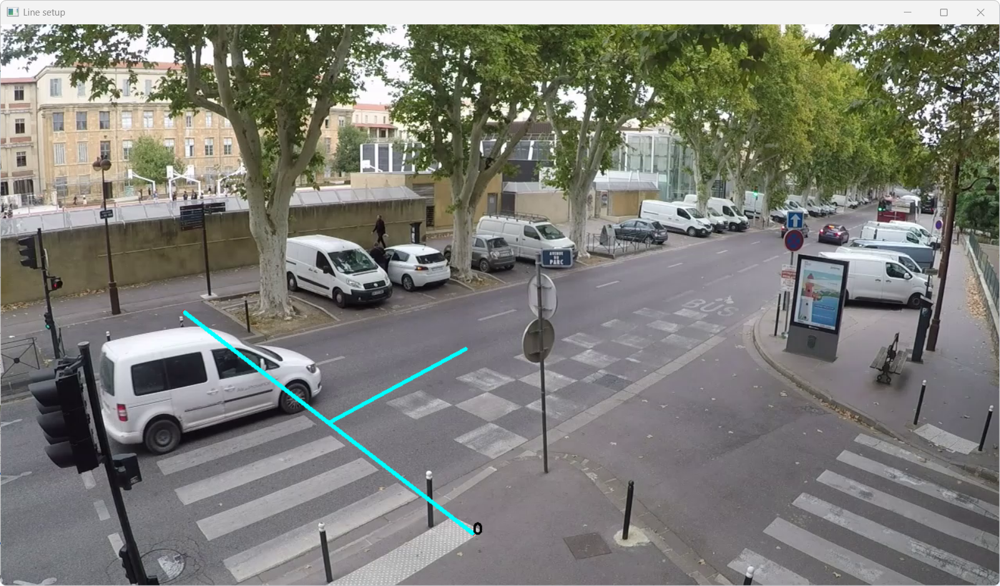</td>
    <td>Good line, covers the lane without encroaching on another or on parked vehicles. Far from occluding obstacles and the edge of the image.</td>
  </tr>
  <tr>
    <td>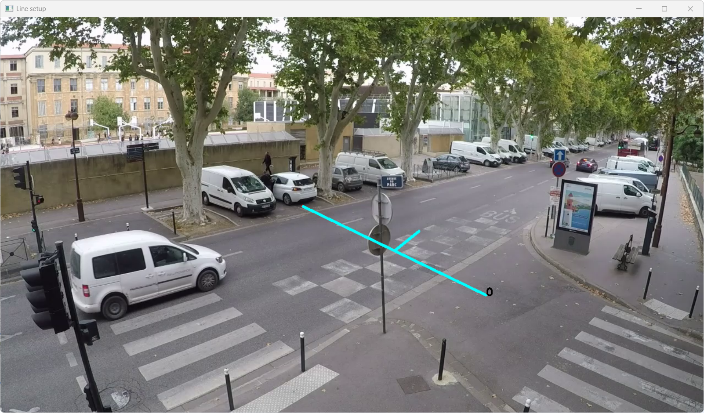</td>
    <td>Could interfere with the entry lane at the bottom right.</td>
  </tr>
  <tr>
    <td>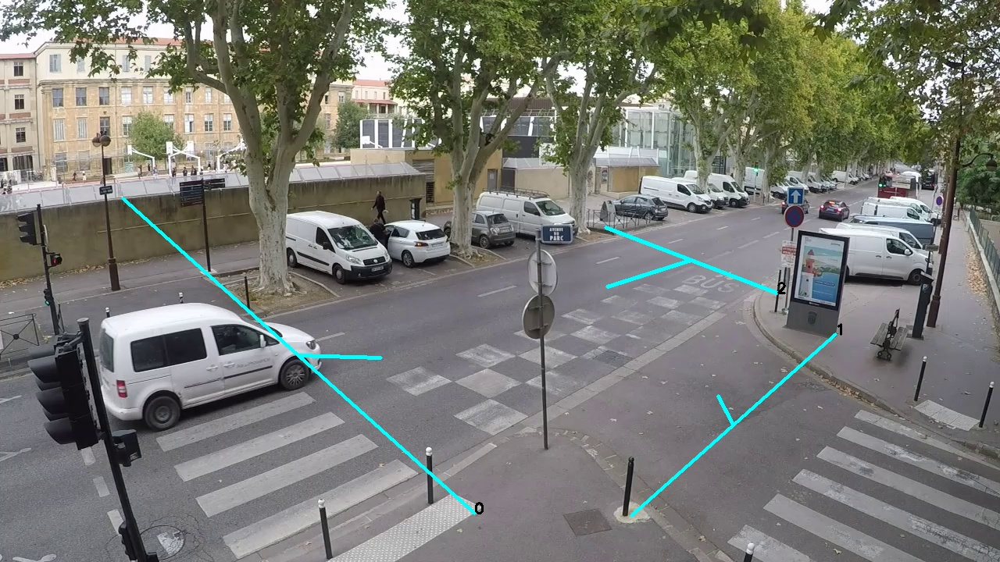</td>
    <td>Example for directional analysis. Lines oriented towards the center of the intersection.</td>
  </tr>
  <tr>
    <td>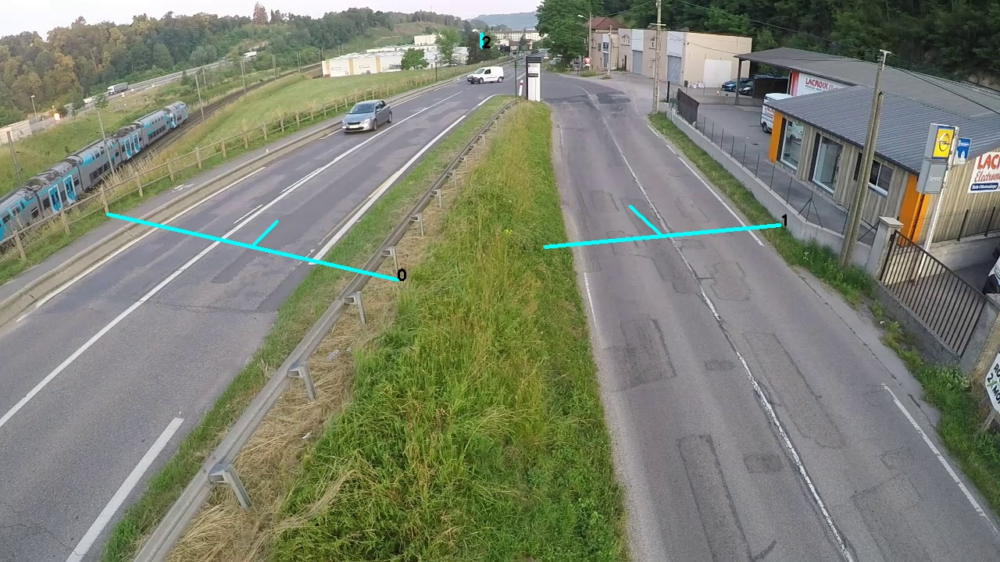</td>
    <td>Lines well placed for their respective lanes. The far lane is occluded by the sign and cannot be counted.</td>
  </tr>
  <tr>
    <td>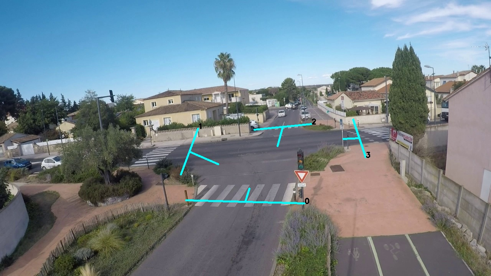</td>
    <td>Another good example for directional analysis.</td>
  </tr>
  <tr>
    <td>
      
      
    </td>
    <td>Be careful that line 0 does not overlap with the container, which could create false positives, especially with lighting variations.</td>
  </tr>
  <tr>
    <td>
      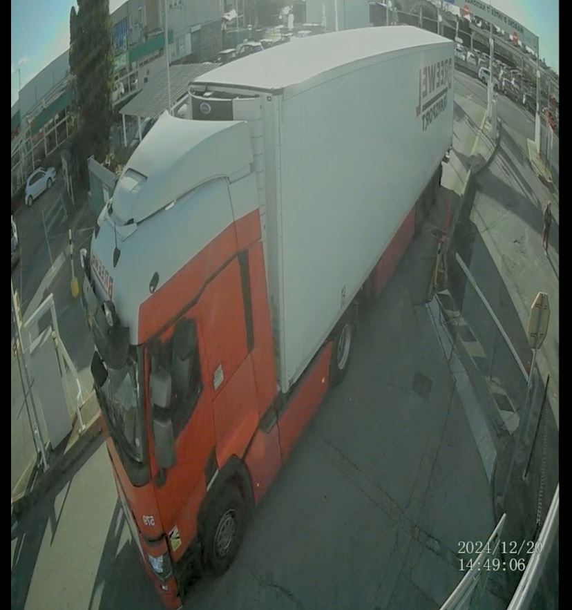
      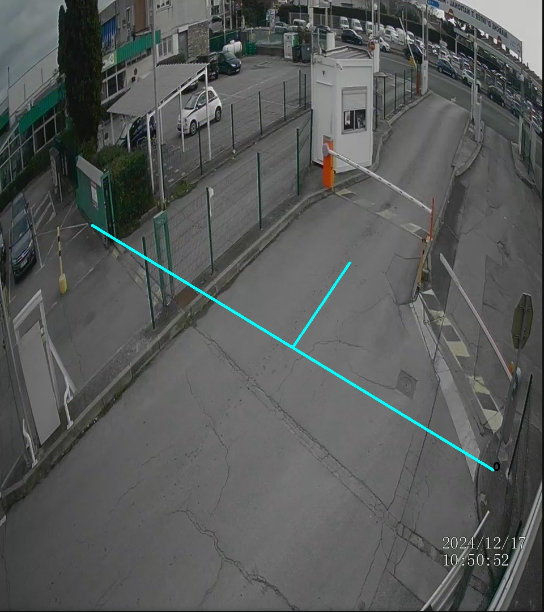
    </td>
    <td>Depending on the camera placement, visual obstructions vary. Here, a two-wheeler was passing behind the truck.</td>
  </tr>
  <tr>
    <td>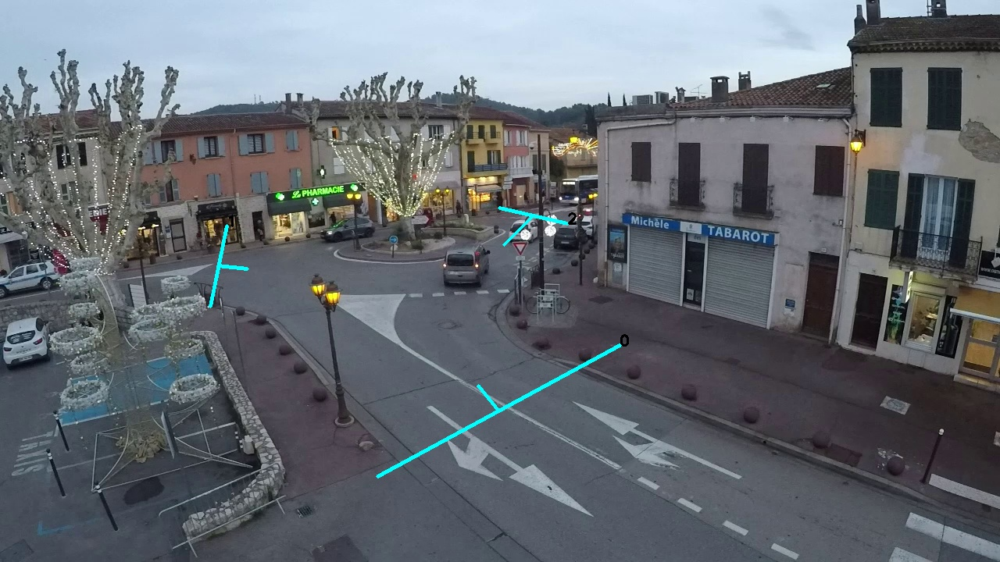</td>
    <td>Well-placed lines. The environment of line 1 (distance, parked vehicles, visual obstacles) makes precise placement crucial and counting difficult.</td>
  </tr>
  <tr>
    <td>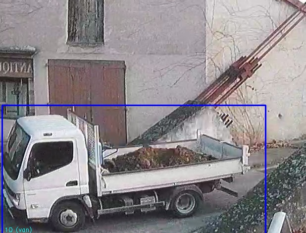</td>
    <td>Here, due to perspective, the AI considered that, in addition to the van, the whole van-truck combination resembled a crane truck and mistakenly counted it. This is due to the line placement, which makes the AI count precisely at this point of overlap.</td>
  </tr>
  <tr>
    <td>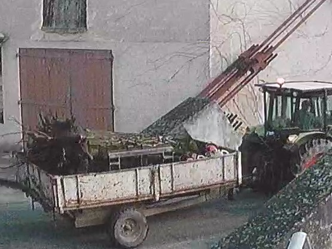</td>
    <td>Generally, trailers are considered separate vehicles.</td>
  </tr>
  <tr>
    <td>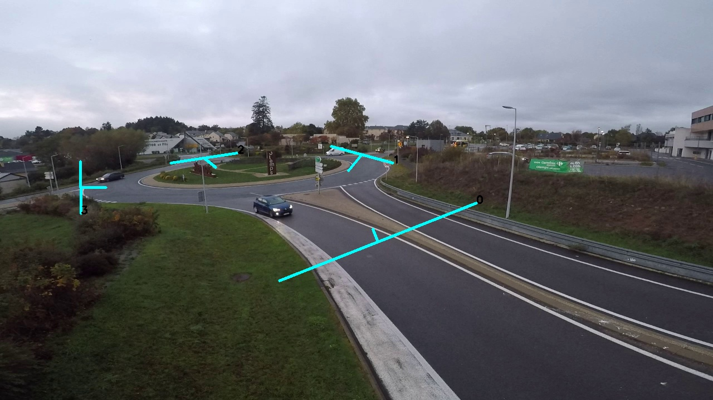</td>
    <td>OD example. The background lines are correctly placed. The left line suffers from an undercounting issue on entry: the thick bushes hide vehicles entering through this lane (but not those exiting). Shifting the line to the right would solve the problem, <b>but</b> vehicles circulating on the roundabout could cross it.</td>
  </tr>
  <tr>
    <td></td>
    <td>Here, line 1, being closer, offers better detection quality. Placing it closer to the bottom of the image could prevent the AI from detecting vehicles before they have crossed the line.</td>
  </tr>
  <tr>
    <td></td>
    <td>Excellent camera placement, the viewing angle allows for near-perfect vehicle detection and categorization. The unambiguous background (building) allows the line to be extended for secure detection without the risk of overcounting.</td>
  </tr>
  <tr>
    <td>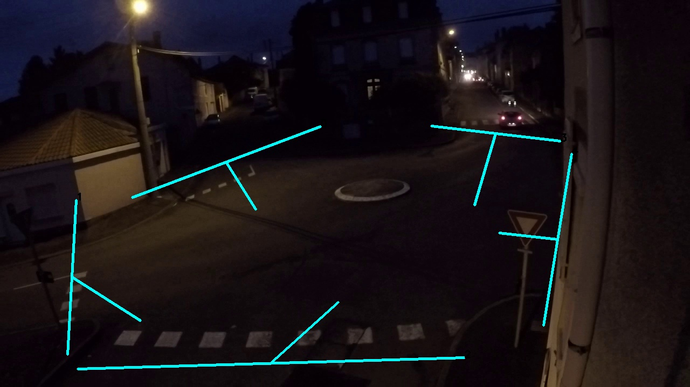</td>
    <td>Beyond the lighting being too low for the AI, the bottom line is too close to the bottom of the image, and the right line is too close to an occluding obstacle (building).</td>
  </tr>
  <tr>
    <td>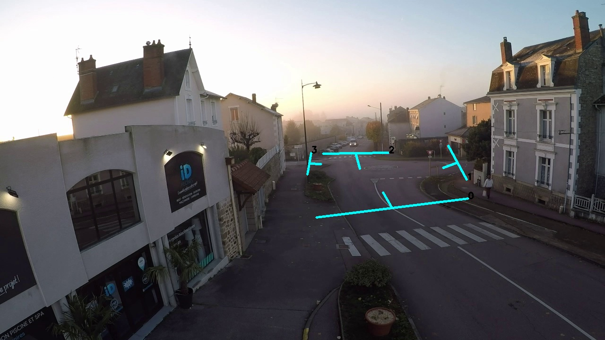</td>
    <td>Good example for directional analysis. Be careful, here the background line was placed slightly too low and sometimes counted vehicles circulating on the roundabout.</td>
  </tr>
  <tr>
    <td>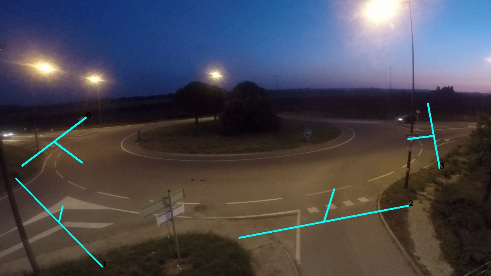</td>
    <td>Good directional example. Here, the bottom lane was analyzed with two lines for more precise detection. There is undercounting on the side lanes due to lack of lighting (vehicles do not stand out well from the background).</td>
  </tr>
</table>
